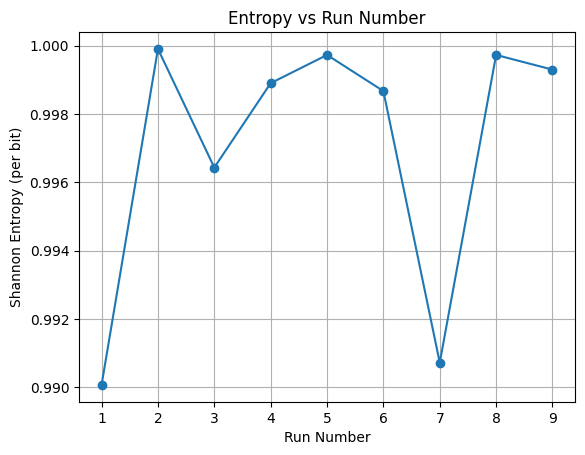
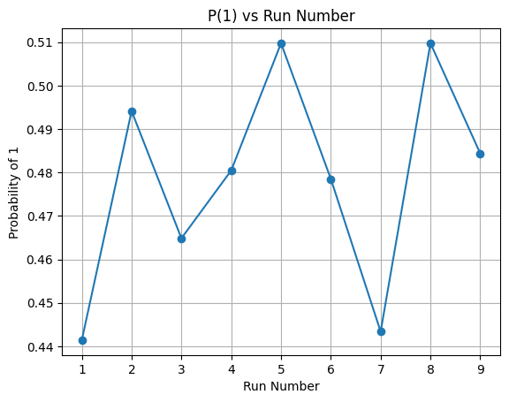
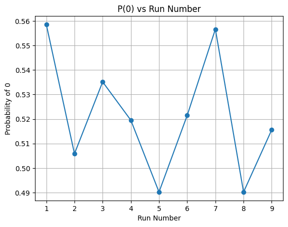
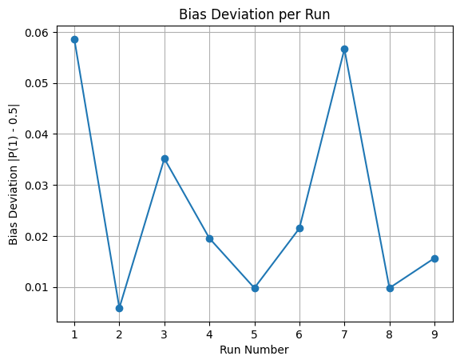
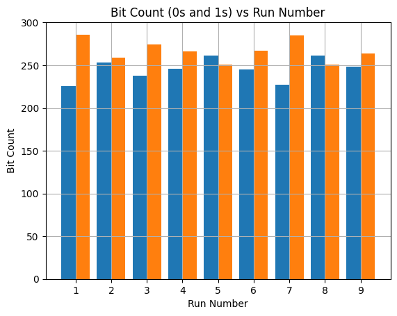
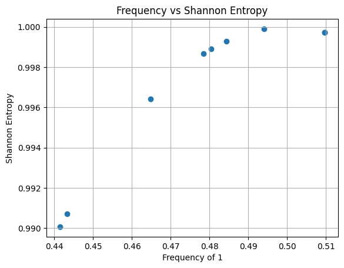
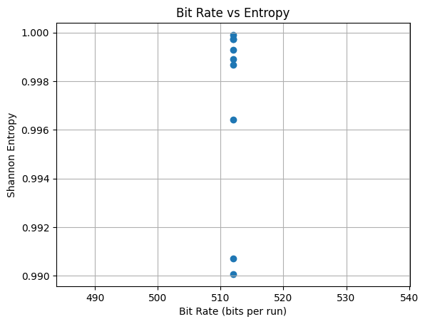

<h2> Experimental Observation Summary</h2>
<h3>Half-Split XOR Hybrid TRNG</h3>

<strong>Platform:</strong> Arduino Uno (ATmega328P)

<strong>Entropy Sources:</strong> SRAM Startup + Analog Noise

<strong>Post-Processing:</strong> Half-Split XOR Folding

<strong>Output Bits per Run:</strong> 512 bits

<h3> Observation Table</h3>

<table border="1" cellpadding="8" cellspacing="0">
<tr>
<th>Run No</th>
<th>Total Bits</th>
<th>Ones</th>
<th>Zeros</th>
<th>P(1)</th>
<th>P(0)</th>
<th>Shannon Entropy (per bit)</th>
</tr>

<tr><td>1</td><td>512</td><td>226</td><td>286</td><td>0.441406</td><td>0.558594</td><td>0.990071</td></tr>
<tr><td>2</td><td>512</td><td>253</td><td>259</td><td>0.494141</td><td>0.505859</td><td>0.999901</td></tr>
<tr><td>3</td><td>512</td><td>238</td><td>274</td><td>0.464844</td><td>0.535156</td><td>0.996431</td></tr>
<tr><td>4</td><td>512</td><td>246</td><td>266</td><td>0.480469</td><td>0.519531</td><td>0.998899</td></tr>
<tr><td>5</td><td>512</td><td>261</td><td>251</td><td>0.509766</td><td>0.490234</td><td>0.999725</td></tr>
<tr><td>6</td><td>512</td><td>245</td><td>267</td><td>0.478516</td><td>0.521484</td><td>0.998668</td></tr>
<tr><td>7</td><td>512</td><td>227</td><td>285</td><td>0.443359</td><td>0.556641</td><td>0.990723</td></tr>
<tr><td>8</td><td>512</td><td>261</td><td>251</td><td>0.509766</td><td>0.490234</td><td>0.999725</td></tr>
<tr><td>9</td><td>512</td><td>248</td><td>264</td><td>0.484375</td><td>0.515625</td><td>0.999295</td></tr>

</table>

<h3> Statistical Summary</h3>

<ul>
<li><strong>Minimum Entropy:</strong> 0.990071 bits</li>
<li><strong>Maximum Entropy:</strong> 0.999901 bits</li>
<li><strong>Average Entropy:</strong> ≈ 0.9969 bits</li>
<li><strong>Ideal Entropy (Theoretical):</strong> 1.0000 bit</li>
</ul>

<h3> Observations</h3>

<ul>
<li>All runs produced entropy greater than <strong>0.99 bits per bit</strong>.</li>
<li>Probability of '1' stayed close to 0.5 in most runs.</li>
<li>Half-Split XOR significantly reduced bias from raw SRAM startup imbalance.</li>
<li>No severe deviation or collapse in entropy observed.</li>
<li>Distribution stabilizes near ideal randomness after XOR folding.</li>
</ul>

<h3>Graphs</h3>

<h3> Conclusion</h3>

The Half-Split XOR Hybrid method demonstrates strong randomness characteristics.
Across 9 independent power-cycle runs, the Shannon entropy consistently remained
very close to the theoretical maximum of 1 bit per output bit.

The XOR folding mechanism effectively balances bias introduced by SRAM startup
variations, resulting in near-uniform probability distribution.

This validates that the proposed Hybrid TRNG architecture is statistically stable,
efficient, and suitable for cryptographic-grade entropy generation in embedded systems.

