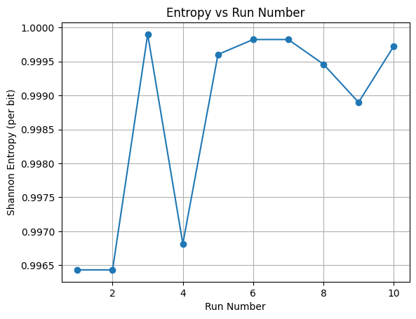
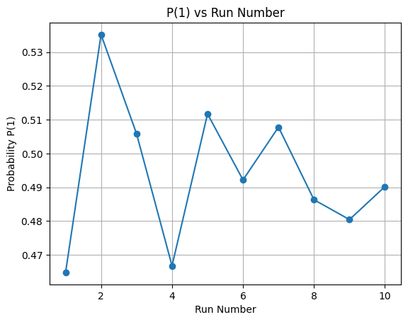
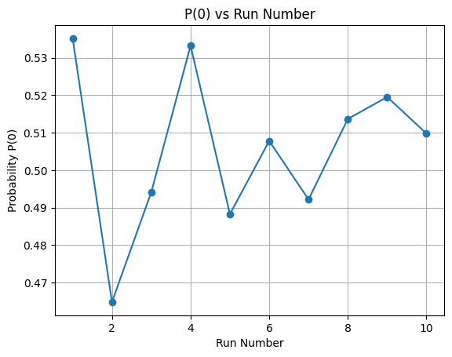
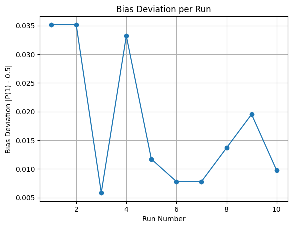
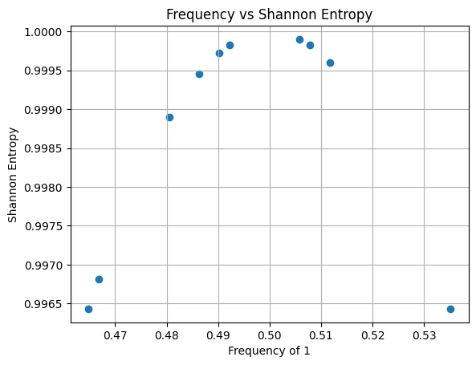
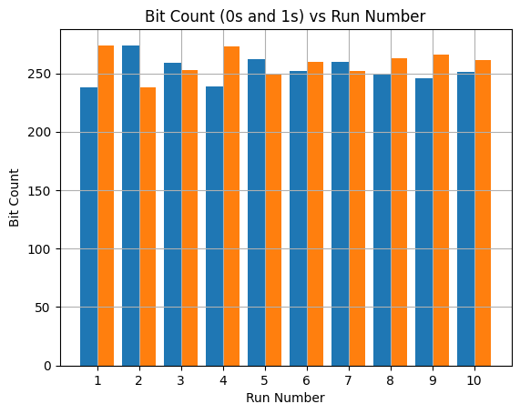
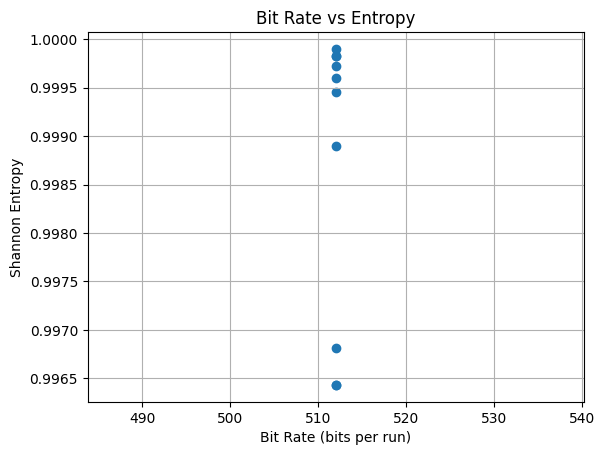

<h2>Experimental Observations</h2>
<h3>Hybrid TRNG: SRAM + Floating Analog + 2-Fold XOR + Von Neumann</h3>

<h3>Observation Table</h3>

<table border="1" cellpadding="8" cellspacing="0">
<tr>
<th>Run</th>
<th>Total Bits</th>
<th>Ones</th>
<th>Zeros</th>
<th>P(1)</th>
<th>Shannon Entropy</th>
</tr>

<tr><td>1</td><td>512</td><td>238</td><td>274</td><td>0.464844</td><td>0.996431</td></tr>
<tr><td>2</td><td>512</td><td>274</td><td>238</td><td>0.535156</td><td>0.996431</td></tr>
<tr><td>3</td><td>512</td><td>259</td><td>253</td><td>0.505859</td><td>0.999901</td></tr>
<tr><td>4</td><td>512</td><td>239</td><td>273</td><td>0.466797</td><td>0.996817</td></tr>
<tr><td>5</td><td>512</td><td>262</td><td>250</td><td>0.511719</td><td>0.999604</td></tr>
<tr><td>6</td><td>512</td><td>252</td><td>260</td><td>0.492188</td><td>0.999824</td></tr>
<tr><td>7</td><td>512</td><td>260</td><td>252</td><td>0.507812</td><td>0.999824</td></tr>
<tr><td>8</td><td>512</td><td>249</td><td>263</td><td>0.486328</td><td>0.999461</td></tr>
<tr><td>9</td><td>512</td><td>246</td><td>266</td><td>0.480469</td><td>0.998899</td></tr>
<tr><td>10</td><td>512</td><td>251</td><td>261</td><td>0.490234</td><td>0.999725</td></tr>

</table>

<h3>Graphs</h3>

<h3> Statistical Summary</h3>

<ul>
<li><strong>Minimum Entropy:</strong> 0.996431</li>
<li><strong>Maximum Entropy:</strong> 0.999901</li>
<li><strong>Average Entropy:</strong> ≈ 0.9987</li>
<li><strong>Total Runs:</strong> 10</li>
</ul>

<h3>Conclusion</h3>

The 2-fold XOR mixing stage combines SRAM startup entropy with two independent
floating analog noise samples per bit. Von Neumann debiasing effectively removes
static bias. Across 10 independent runs, Shannon entropy consistently remains above
0.996 bits per output bit, demonstrating stable hybrid TRNG behavior.

