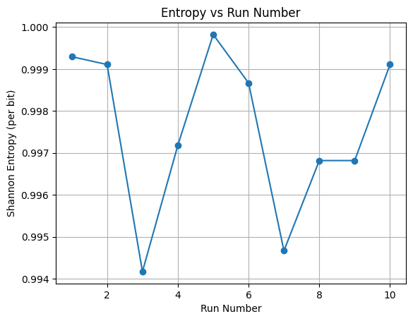
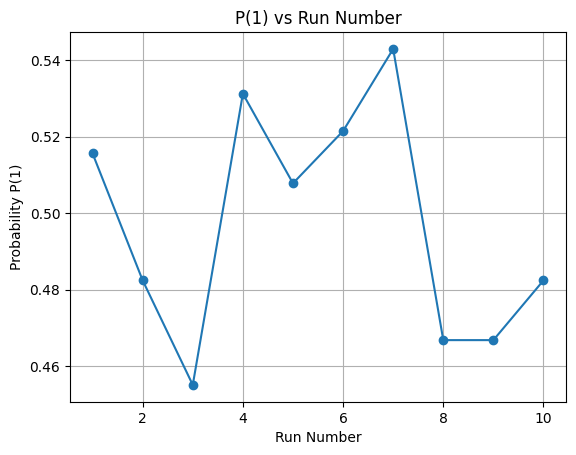
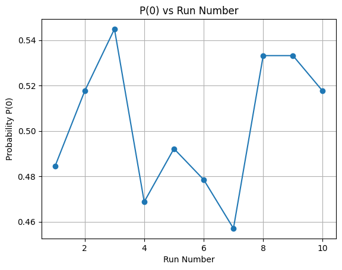
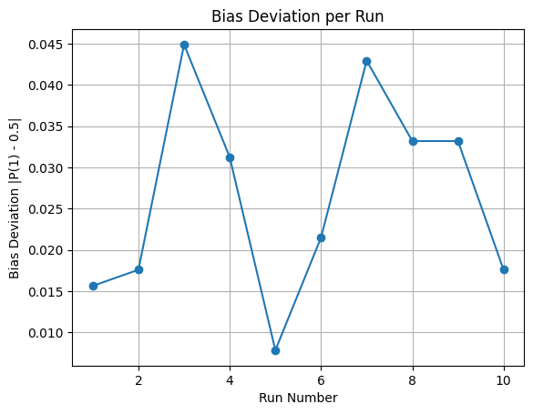
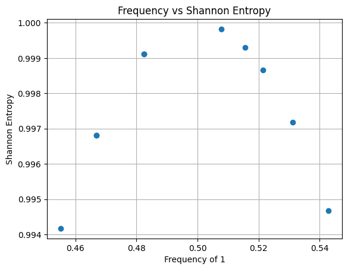
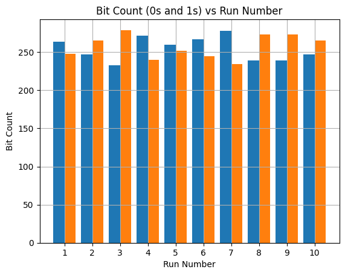
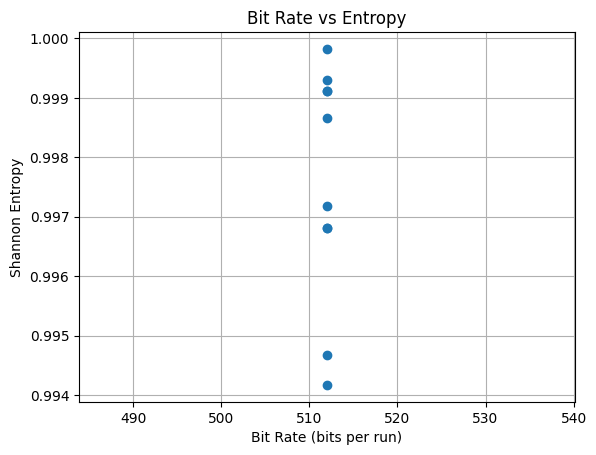

<h2>Experimental Observations</h2>
<h3>Hybrid TRNG: SRAM + Floating Analog + 8-Fold XOR + Von Neumann</h3>

<h3>Observation Table</h3>

<table border="1" cellpadding="8" cellspacing="0">
<tr>
<th>Run</th>
<th>Total Bits</th>
<th>Ones</th>
<th>Zeros</th>
<th>P(1)</th>
<th>Shannon Entropy</th>
</tr>

<tr><td>1</td><td>512</td><td>264</td><td>248</td><td>0.515625</td><td>0.999295</td></tr>
<tr><td>2</td><td>512</td><td>247</td><td>265</td><td>0.482422</td><td>0.999108</td></tr>
<tr><td>3</td><td>512</td><td>233</td><td>279</td><td>0.455078</td><td>0.994169</td></tr>
<tr><td>4</td><td>512</td><td>272</td><td>240</td><td>0.531250</td><td>0.997180</td></tr>
<tr><td>5</td><td>512</td><td>260</td><td>252</td><td>0.507812</td><td>0.999824</td></tr>
<tr><td>6</td><td>512</td><td>267</td><td>245</td><td>0.521484</td><td>0.998668</td></tr>
<tr><td>7</td><td>512</td><td>278</td><td>234</td><td>0.542969</td><td>0.994666</td></tr>
<tr><td>8</td><td>512</td><td>239</td><td>273</td><td>0.466797</td><td>0.996817</td></tr>
<tr><td>9</td><td>512</td><td>239</td><td>273</td><td>0.466797</td><td>0.996817</td></tr>
<tr><td>10</td><td>512</td><td>247</td><td>265</td><td>0.482422</td><td>0.999108</td></tr>

</table>

<h3>Graphs</h3>

<h3> Statistical Summary</h3>

<ul>
<li><strong>Minimum Entropy:</strong> 0.994169</li>
<li><strong>Maximum Entropy:</strong> 0.999824</li>
<li><strong>Average Entropy:</strong> ≈ 0.9979</li>
<li><strong>Total Runs:</strong> 10</li>
</ul>

<h3>Conclusion</h3>

The 8-fold XOR mixing stage increases entropy diffusion by incorporating multiple 
independent analog noise samples per output bit. Combined with SRAM startup entropy 
and Von Neumann debiasing, the system consistently achieves Shannon entropy above 0.99 
bits per output bit across all experimental runs.

No entropy collapse or systematic bias drift was observed, confirming stable hybrid 
TRNG behavior suitable for embedded cryptographic experimentation.

