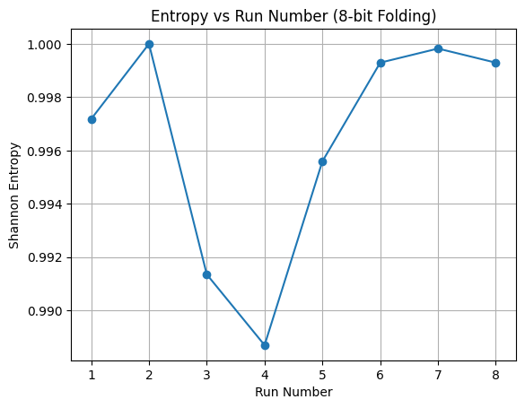
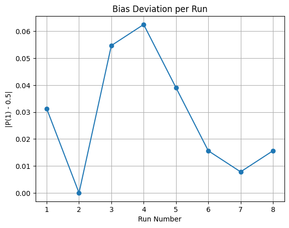
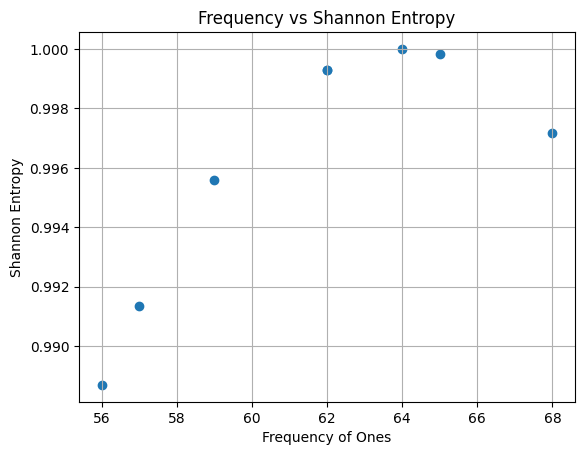
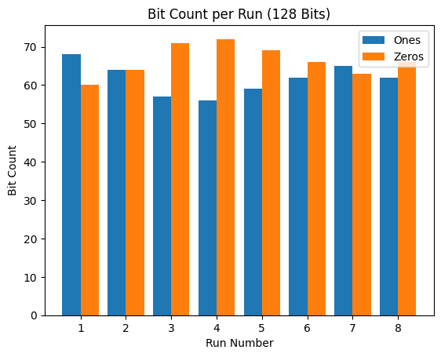
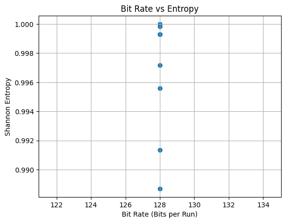

<h2>SRAM Startup + Floating Analog Noise + XOR + 8-bit Folding Observation</h2>

<strong>Platform:</strong> Arduino Uno (ATmega328P)

<strong>Method:</strong> SRAM Startup + Floating Analog Noise + XOR + 8-bit Folding

<strong>Output per Trial:</strong> 128 Bits

<h2>Observation Table</h2>

<table>
  <thead>
    <tr>
      <th>Trial</th>
      <th>Total Bits</th>
      <th>Ones</th>
      <th>Zeros</th>
      <th>P(1)</th>
      <th>P(0)</th>
      <th>Shannon Entropy</th>
    </tr>
  </thead>
  <tbody>
    <tr>
      <td>1</td><td>128</td><td>68</td><td>60</td>
      <td>0.531250</td><td>0.468750</td><td>0.997180</td>
    </tr>
    <tr>
      <td>2</td><td>128</td><td>64</td><td>64</td>
      <td>0.500000</td><td>0.500000</td><td>1.000000</td>
    </tr>
    <tr>
      <td>3</td><td>128</td><td>57</td><td>71</td>
      <td>0.445313</td><td>0.554687</td><td>0.991353</td>
    </tr>
    <tr>
      <td>4</td><td>128</td><td>56</td><td>72</td>
      <td>0.437500</td><td>0.562500</td><td>0.988699</td>
    </tr>
    <tr>
      <td>5</td><td>128</td><td>59</td><td>69</td>
      <td>0.460938</td><td>0.539062</td><td>0.995593</td>
    </tr>
    <tr>
      <td>6</td><td>128</td><td>62</td><td>66</td>
      <td>0.484375</td><td>0.515625</td><td>0.999295</td>
    </tr>
    <tr>
      <td>7</td><td>128</td><td>65</td><td>63</td>
      <td>0.507812</td><td>0.492188</td><td>0.999824</td>
    </tr>
    <tr>
      <td>8</td><td>128</td><td>62</td><td>66</td>
      <td>0.484375</td><td>0.515625</td><td>0.999295</td>
    </tr>
  </tbody>
</table>

<h3>Graphs</h3>

<h3>Conclusion</h3>

The hybrid entropy extraction method consistently produces near-ideal 
Shannon entropy values approaching 1.0 bits per bit. The probability 
distribution remains close to 0.5 across multiple power cycles, 
indicating effective bias reduction through XOR mixing and 8-bit folding.

