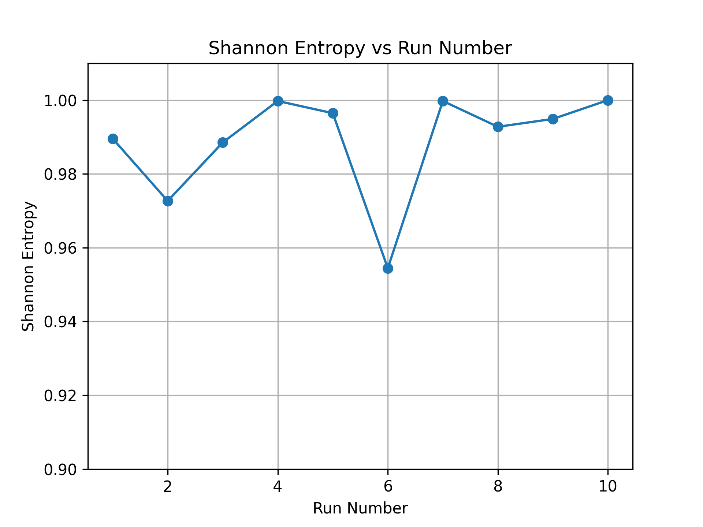
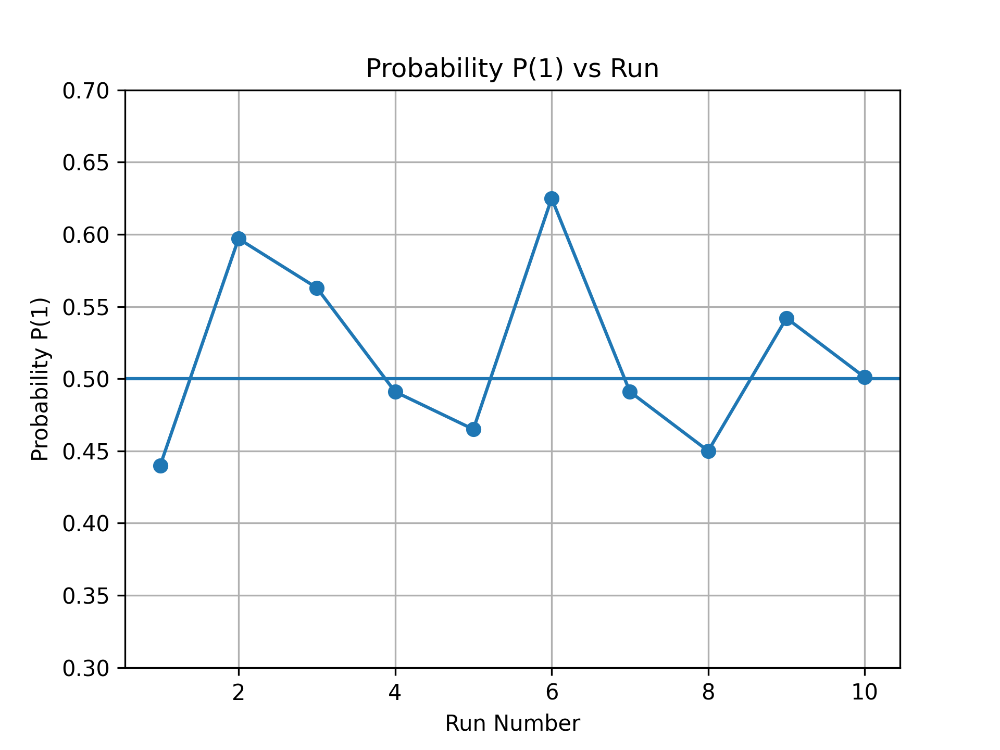
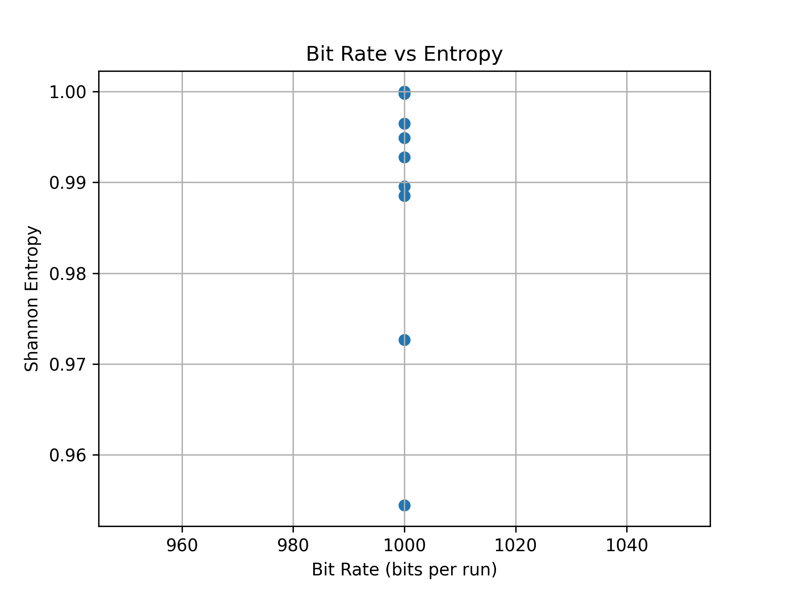

<h1>Floating Analog Pin Entropy Experimental Observation</h1>

<strong>Platform:</strong> Arduino Uno (ATmega328P)

<strong>Entropy Source:</strong> Floating Analog Pin (A0)

<strong>Sample Size per Run:</strong> 1000 bits

<h2>Experimental Data</h2>

<table>
<tr>
<th>Run</th>
<th>Ones</th>
<th>Zeros</th>
<th>P(1)</th>
<th>Shannon Entropy</th>
</tr>

<tr><td>1</td><td>440</td><td>560</td><td>0.440</td><td>0.989587</td></tr>
<tr><td>2</td><td>597</td><td>403</td><td>0.597</td><td>0.972678</td></tr>
<tr><td>3</td><td>563</td><td>437</td><td>0.563</td><td>0.988517</td></tr>
<tr><td>4</td><td>491</td><td>509</td><td>0.491</td><td>0.999766</td></tr>
<tr><td>5</td><td>465</td><td>535</td><td>0.465</td><td>0.996462</td></tr>
<tr><td>6</td><td>625</td><td>375</td><td>0.625</td><td>0.954434</td></tr>
<tr><td>7</td><td>491</td><td>509</td><td>0.491</td><td>0.999766</td></tr>
<tr><td>8</td><td>450</td><td>550</td><td>0.450</td><td>0.992774</td></tr>
<tr><td>9</td><td>542</td><td>458</td><td>0.542</td><td>0.994904</td></tr>
<tr><td>10</td><td>501</td><td>499</td><td>0.501</td><td>0.999997</td></tr>

</table>

<h2>Observations</h2>

<ul>
<li>Entropy remains consistently high (0.95 – 0.9999).</li>
<li>Bit distribution fluctuates around ideal 50–50 balance.</li>
<li>Environmental noise influences probability variations.</li>
<li>Worst-case entropy observed: 0.954.</li>
<li>Best-case entropy observed: ~0.9999.</li>
</ul>

<h2>Conclusion</h2>

The floating analog pin demonstrates strong entropy characteristics suitable
for embedded TRNG applications. Minor fluctuations occur due to environmental
influences, but overall entropy performance remains near ideal. Further validation
with min-entropy and NIST statistical testing is recommended.

<h2>Graphs</h2>

## Shannon Entropy vs Run

## Probability P(1) vs Run

## Bit Rate vs Entropy

